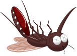

<section class="hero">
  

      
    <h1 class="hero__title">Baygon</h1>
    
Minimalistic functional test framework

    

      <a class="md-button md-button--primary" href="getting-started/">Getting Started</a>
      <a class="md-button" href="syntax/">Explore the syntax</a>
    

  

</section>
